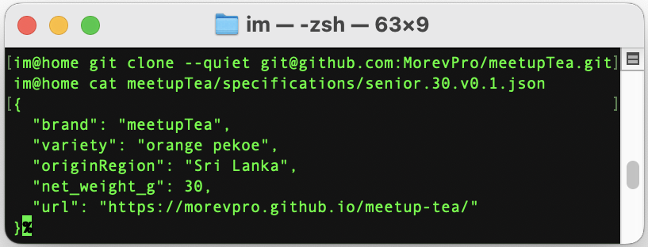

# 🍵 meetupTea — Senior

## Orange Pekoe OPA | Ceylon | Large Leaf | Pure Source

Когда я был в Шри-Ланке, попробовал этот чай и пил его все десять дней подряд. Вернувшись в Москву, пытался найти что-то похожее — перебрал кучу магазинов с «элитным» чаем, тратил деньги, но почти всегда попадалось разбавленное сырье. Тогда я решил: проще самому заказать прямо из Шри-Ланки. Так я нашёл свой вкус. И теперь хочу поделиться им с вами — от айтишника айтишникам.

> 100% цельный крупнолистовой цейлонский чай. Его почти всегда разбавляют более дешёвым сырьем. 
> Без ароматизаторов. Без пыли. Без «синтаксического сахара».
> Orange Pekoe OPA (Orange Pekoe A)** — это крупный, цельный лист.

##  Open-source подход 
- Хотите новый вкус — [создайте Issue](https://github.com/MorevPro/meetupTea/issues/new)
- Нашли ошибку - commit в репу, плюс в карму
- Хотите заказать - [пишите в личку](https://t.me/ivanmorev)
- Поделиться рецептом, найти единомышленников - [группа Telegram](https://t.me/meetupTea)

##  Specification
### 30g 

[Спецификация](specifications/senior.30.v0.1.json)

## Offer

* Фасовка: 50 г
* Цена:  700₽
* 🚚 Отправка по России в день оплаты СДЭК / Курьер / Почта России 

## Почему meetupTea?

Потому что чай — это повод собраться.
Обсудить Python, Go, Rust или просто жизнь.

---

## Links
[Объявление в Avito](https://www.avito.ru/) | [Группа в ТГ](https://t.me/meetupTea)
---
### How to use

`git clone --quiet git@github.com:MorevPro/meetupTea.git
cat meetupTea/specifications/senior.30.v0.1.json 
`
`{
  "brand": "meetupTea",
  "variety": "orange pekoe",
  "originRegion": "Sri Lanka",
  "net_weight_g": 30,
  "url": "https://morevpro.github.io/meetup-tea/"
}%`